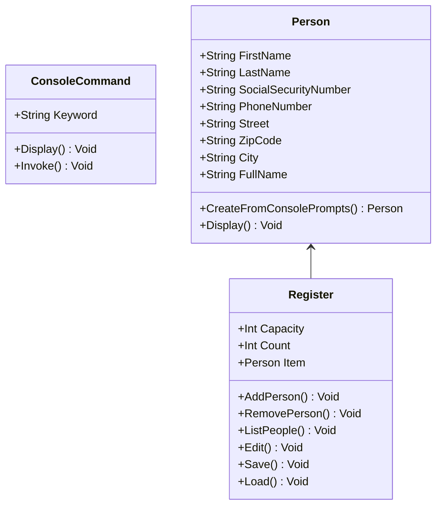

# Personalregister [Description](Övning%201.NET.pdf)

## Vilka klasser bör ingå i projektet? ( skriven innan jag började koda )

Person, PersonRegister

## Vilka attribut och metoder bör ingå i dessa klasser?

Person: Förnamn, Efternamn, Personnummer, Telefonnummer, Adress, Postnummer, Postort

PersonRegister: Lista med personer, LäggTillPerson(), TaBortPerson(), VisaPersoner(), LaddaRegister(), SparaRegister()

## Det jag hann med under uppgiftens tid av ca 1 timme 45 minuter

Person klassen

PersonRegister klassen

ConsoleCommand klassen

grundläggande programflöde

## Det jag lade till efteråt

LaddaRegister() och SparaRegister() i PersonRegister klassen

exekvering av kommandon

spara och ladda frön fil

välja person att tex ta bort (Remove kommandot)

## Det som behöver förbättras/läggas till

Separera UI frön logik, med andra ord separera Console write och read från logiken i Person och PersonRegister klassen

Gör klart Edit kommandot

Gör om PersonRegister klassen Från att ärva från ``List<Person>`` till att ha en ``List<Person>`` som attribut och enbart exponera de metoder som behövs

## Diagram

