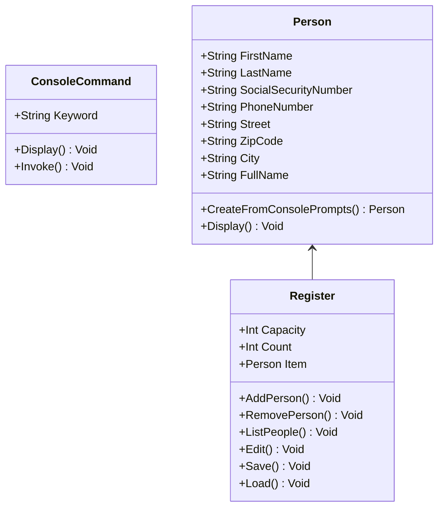

```mermaid
classDiagram

class ConsoleCommand
ConsoleCommand : +String Keyword
ConsoleCommand : +Display() Void
ConsoleCommand : +Invoke() Void

class Person
Person : +String FirstName
Person : +String LastName
Person : +String SocialSecurityNumber
Person : +String PhoneNumber
Person : +String Street
Person : +String ZipCode
Person : +String City
Person : +String FullName
Person : +CreateFromConsolePrompts() Person
Person : +Display() Void

class Register
Register : +Int Capacity
Register : +Int Count
Register : +Person Item
Register : +AddPerson() Void
Register : +RemovePerson() Void
Register : +ListPeople() Void
Register : +Edit() Void
Register : +Save() Void
Register : +Load() Void


Person <-- Register

```
